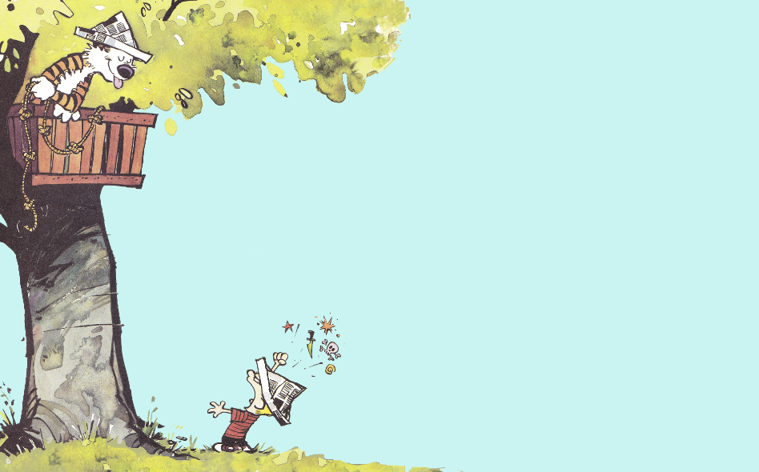
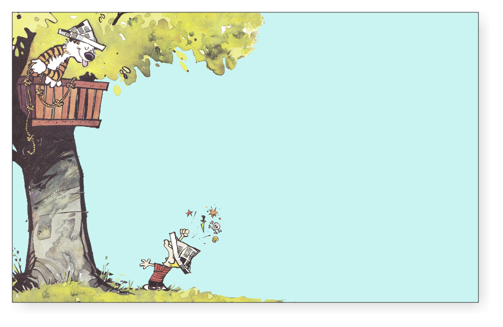
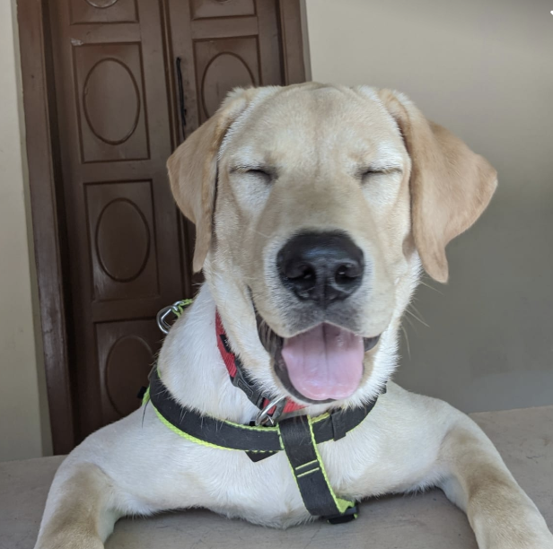
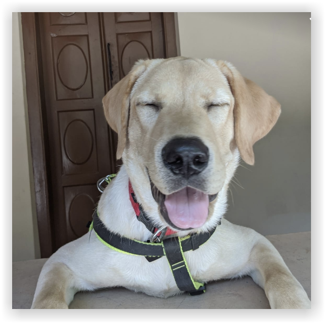

# ImageDropShadow

Image drop shadow using Go.

# Usage

Download the executable and run from the command prompt

## Options

* _-i_: Path to input image
* _-t_: Transparent background

e.g.

```
$ ./imageDropShadow-mac -i cnh.png
```

```
$ ./imageDropShadow-mac -i joey.png -t
```

# Samples

## Input 1



Output



---

## Input 2



Output

